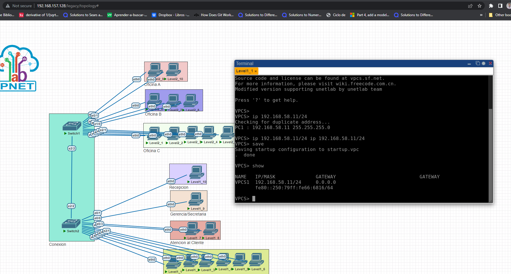
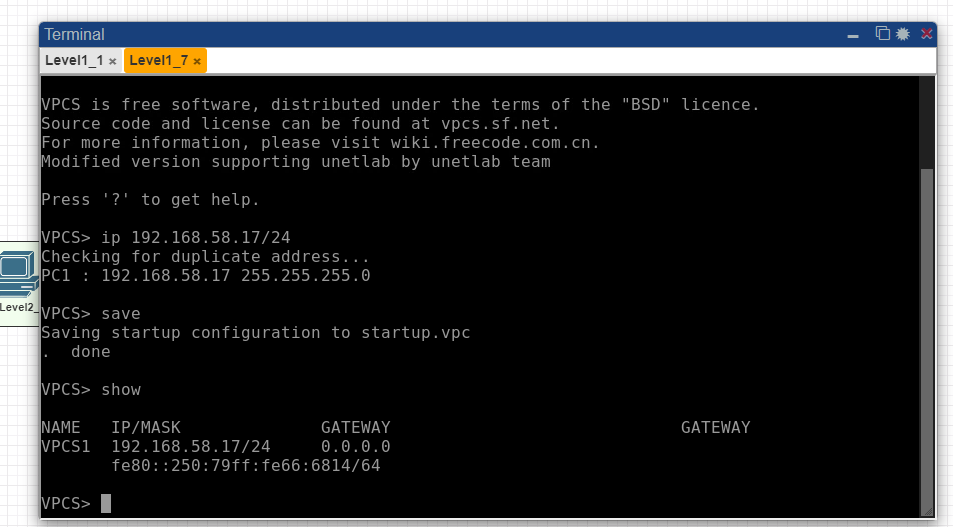
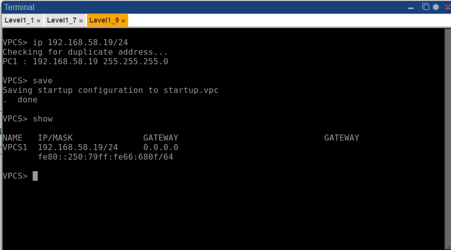
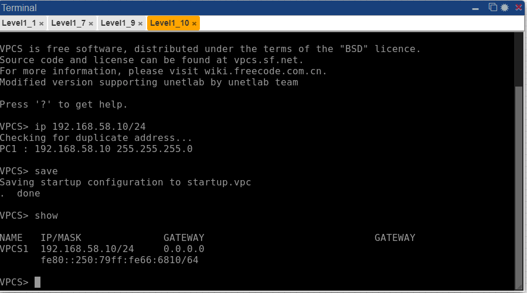
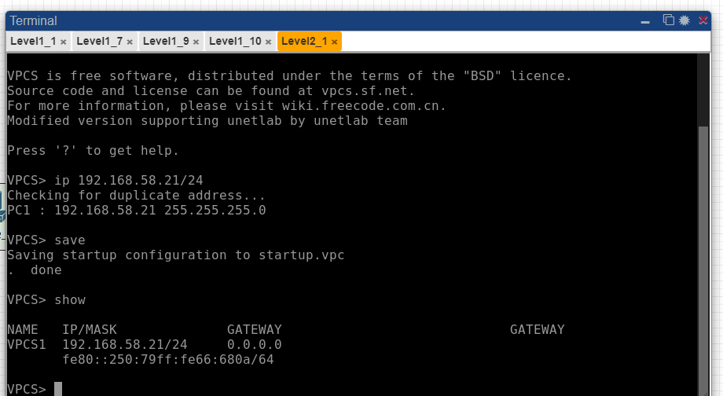
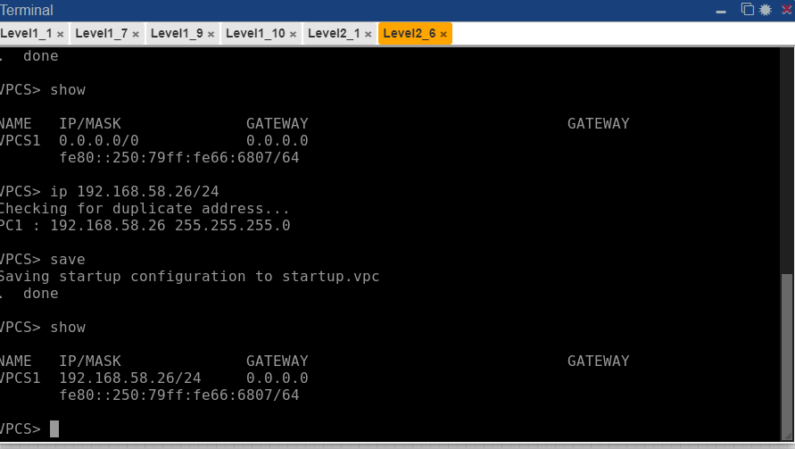
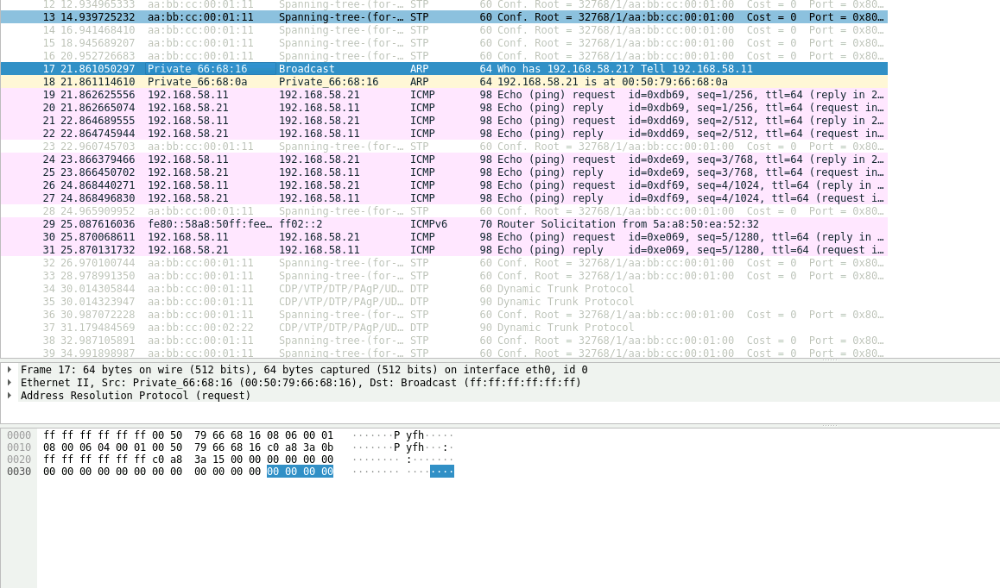
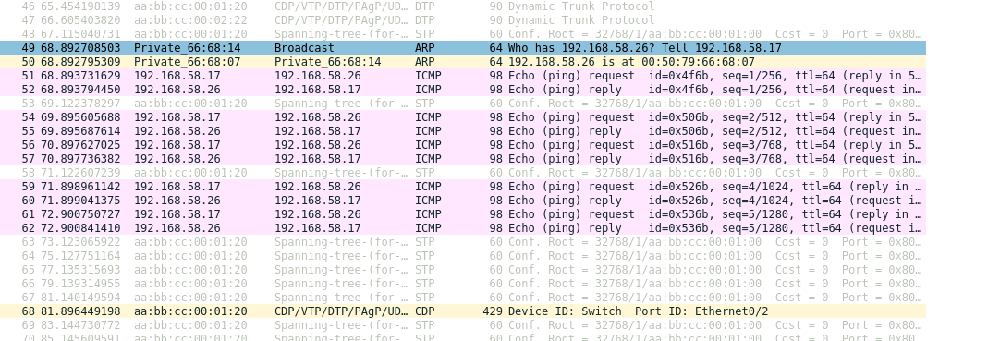
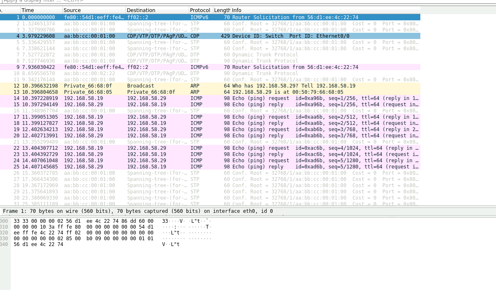
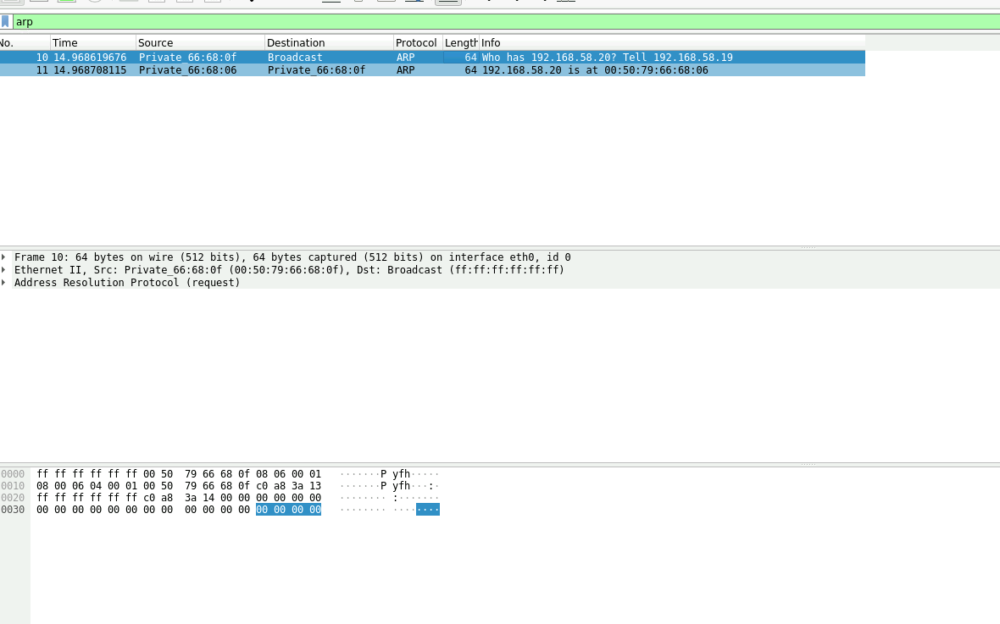

# Redes 1 - Práctica 1 - Manual Técnico

| Nombre                           | Carné                                      |
|:--------------------------------:|:------------------------------------------:|
| Erick Ivan Mayorga Rodríguez     | 201901758                                 	|

## INTRODUCCIÓN

Se realizo una topologia de red para un negocio de dos niveles, teniendo a considercion el uso de dos switches, uno para cada nivel, ademas de que existan comunicacion entre los dos niveles. 

## Configuracion de las VPCs

### VPC Nivel 1- Oficina

### VPC Nivel 1- Atencion al Cliente

### VPC Nivel 1- Gerencia/Secretaria 

### VPC Nivel 1- Recepcion

### VPC Nivel 2- Oficina C

### VPC Nivel 2- Oficina B

### VPC Nivel 2- Oficina A

## Ping entre los Host 

### Ping Computadora 1 Nivel 1 - Computadora 1 Nivel 2

### Ping Computadora 7 Nivel 1 - Computadora 6 Nivel 2

### Ping Computadora 9 Nivel 1 - Computadora 9 Nivel 2

## Captura de un paquete ARP

