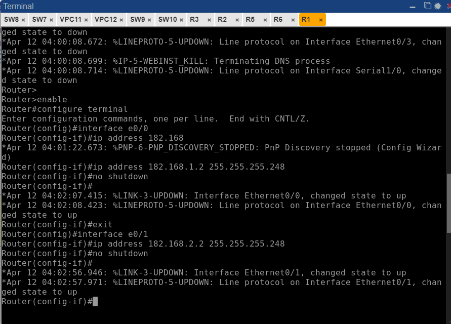
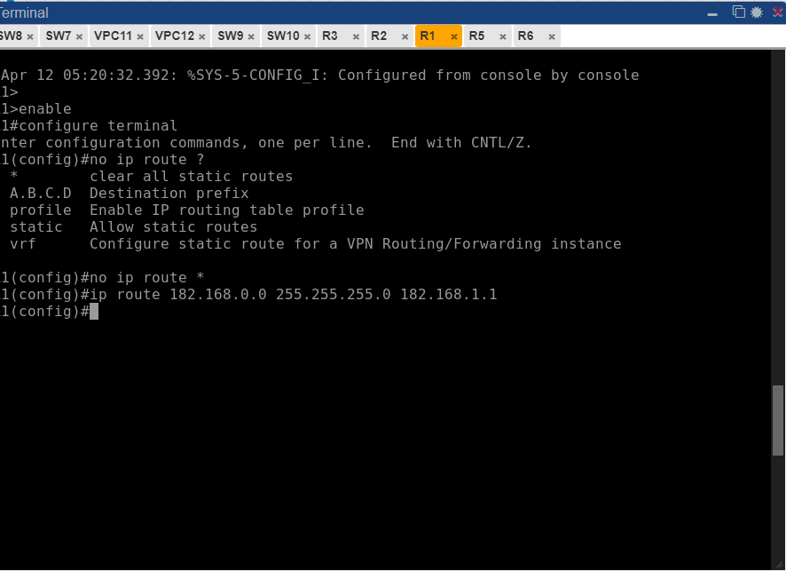
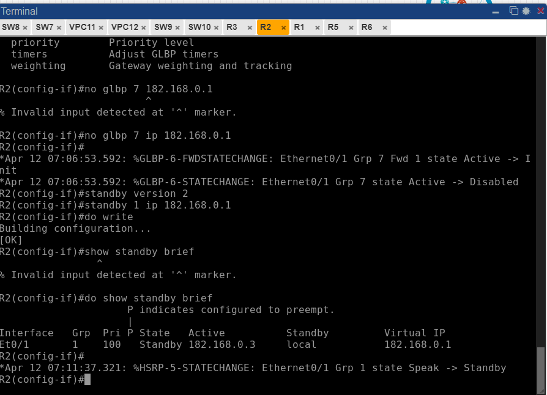
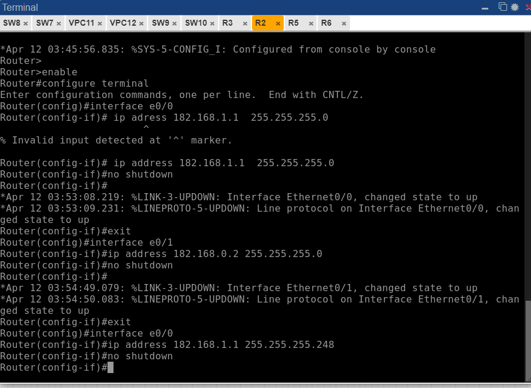
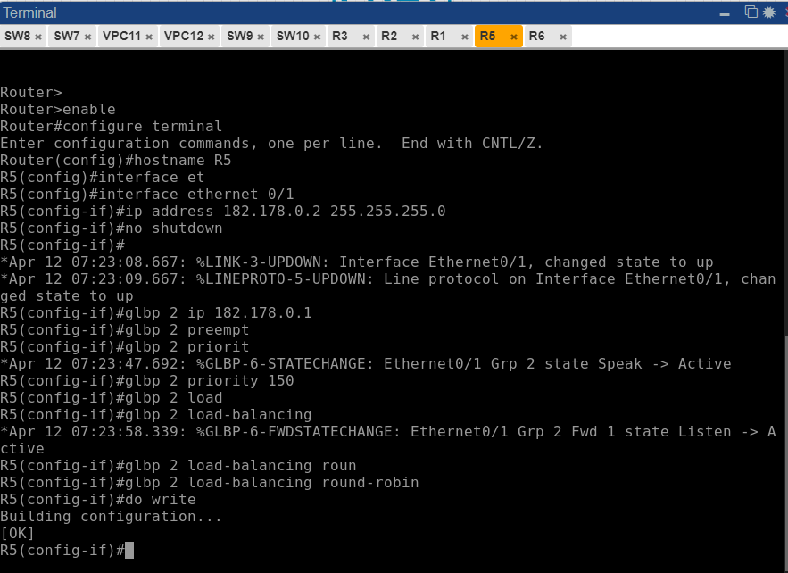
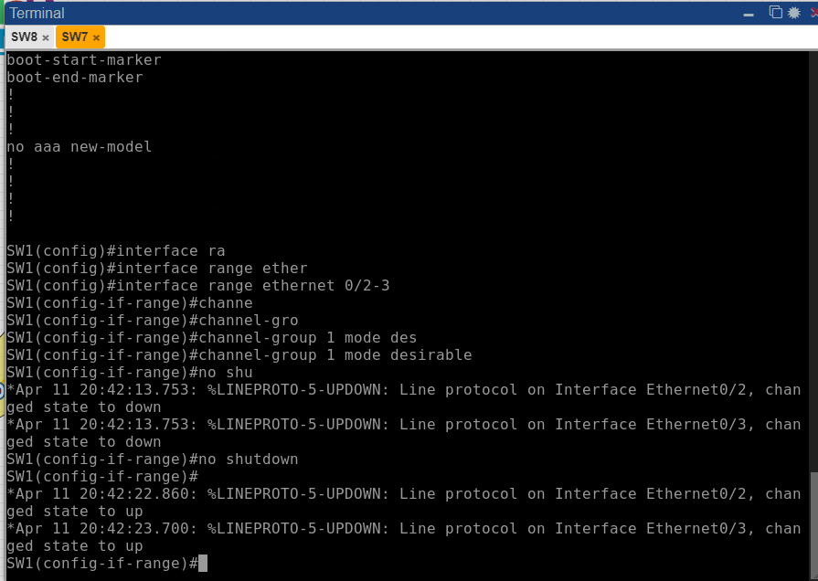
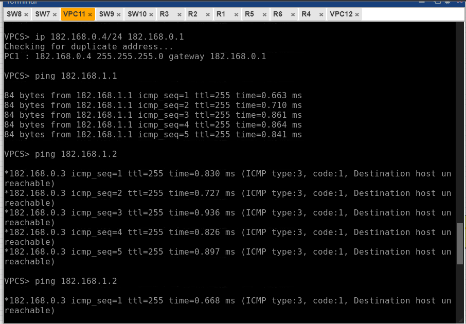

# Redes 1 - Practica2 - Manual Técnico

| Nombre                           | Carné                                      |
|:--------------------------------:|:------------------------------------------:|
| Erick Ivan Mayorga Rodríguez     | 201901758                                 	|

## Configuraciones

### R1

 

 

### R2

 

 

### R5

 

### SW7

 

### VPC11

 
 

## Comandos Usados

### Creación de ruta estática

configure terminal

!configuramos la primera interfaz, la puerta de enlace predeterminada

interface e0/1    
ip address 10.0.0.1 255.255.255.0

no shutdown

!configuramos el primer enlace entre routers

interface e0/0  
ip address 11.0.0.1 255.255.255.252

no shutdown

!configuramos las rutas estáticas

!hacia 11.0.0.0  
ip route 11.0.0.0 255.255.255.252 11.0.0.2

!hacia 192.167.0.0     
ip route 192.167.0.0 255.255.255.252 11.0.0.2  
!hacia 192.168.0.0  
ip route 192.168.0.0 255.255.255.0 11.0.0.2  
 

 
 

### Creación PortChannel con PAGP y LACP

S1  
configure terminal  
interface range f0/3-4  
channel-group 1 mode desirable  
no shutdown  

S3  
configure terminal  
interface range f0/3-4  
channel-group 1 mode auto  
no shutdown  

S1  
configure terminal  
interface range f0/1-2  
channel-group 2 mode active  
no shutdown  

S2 
configure terminal  
interface range f0/1-2  
channel-group 2 mode passive  
no shutdown

 
 

### Creación de IP virtual con HSRP y GLBP 

Configurando a R1  
enable  
configure terminal  
!le definimos su nombre  
hostname R1  

!configuramos la interfaz  
interface Ethernet 0/0  
ip address 10.0.0.2 255.255.255.0  
no shutdown  

!usamos la version 2 de HSRP  
standby version 2 

!definimos su id de grupo HSRP y la dirección ip virtual del gateway  
standby 21 ip 10.0.0.1  

!también le definimos su prioridad  
standby 21 priority 109  

!configuramos el preempt, que sirve para que recupere la prioridad una se recupere la comunicación  
standby 21 preempt  

!guardamos  
do write  
Configurando a R2  
enable  
configure terminal  
hostname R2  
interface Ethernet 0/0  
ip address 10.0.0.3 255.255.255.0  
no shutdown  
standby version 2  
standby 21 ip 10.0.0.1  
do write  

Configurando a R3  
enable  
configure terminal  
hostname R3  
interface Ethernet 0/0  
ip address 192.168.0.2 255.255.255.0  
no shutdown  
glbp 7 ip 192.168.0.1  
glbp 7 preempt  
glbp 7 priority 150  
glbp 7 load-balancing round-robin  
do write  
Configurando a R4  
enable  
configure terminal  
hostname R4  
interface Ethernet 0/0  
ip address 192.168.0.3  
no shutdown  
glbp 7 ip 192.168.0.1  
glbp 7 load-balancing round-robin  
do write  

 
 

### Configuración de VPC
VPC11

ip 182.168.0.4/24 182.168.0.1 

VPC12

ip 182.178.0.4/24 182.178.0.1 

