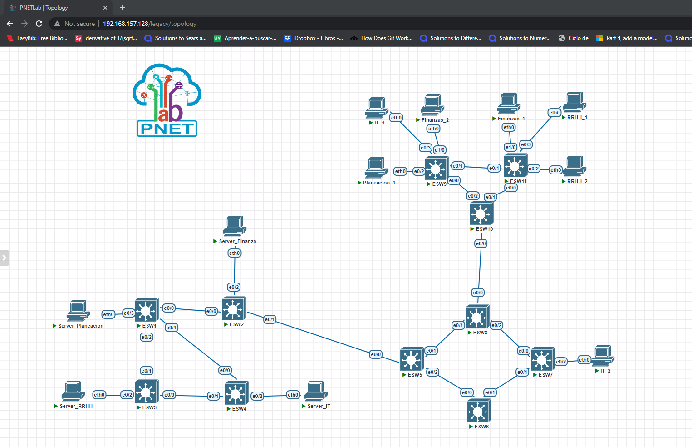
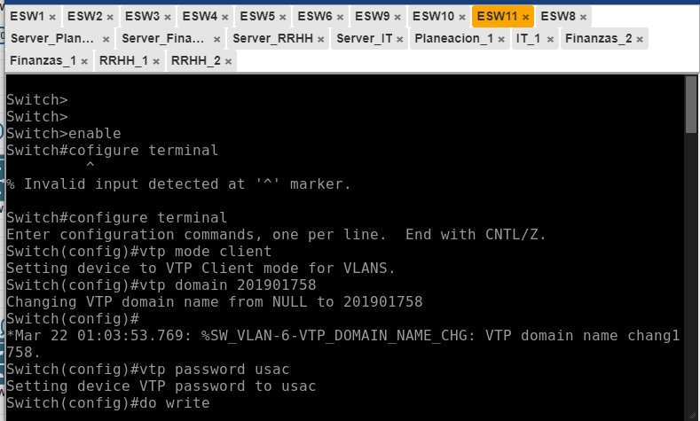
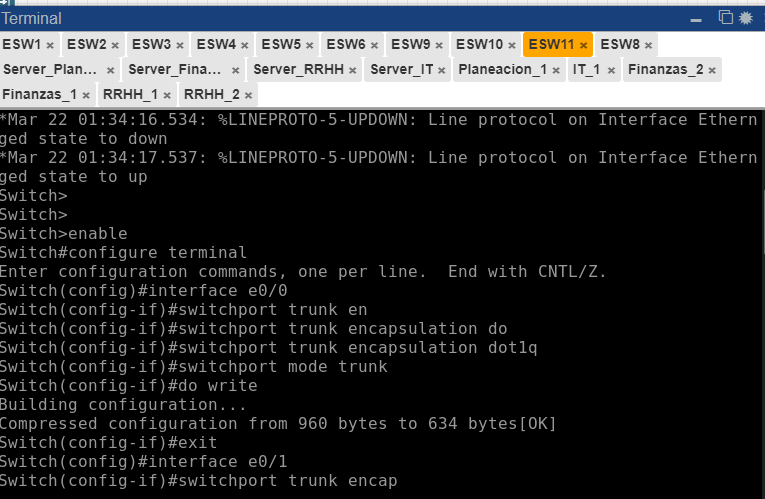
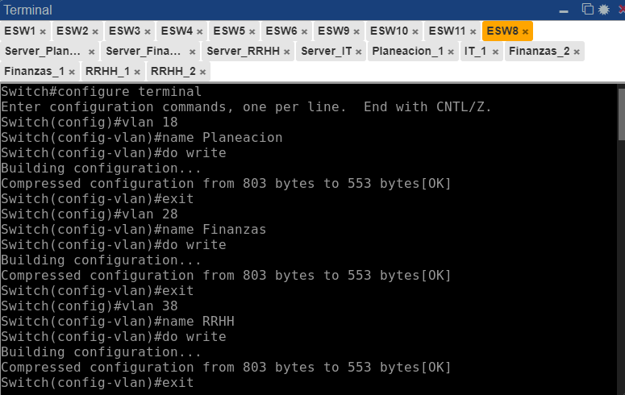
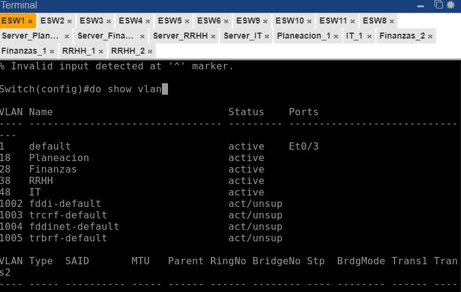
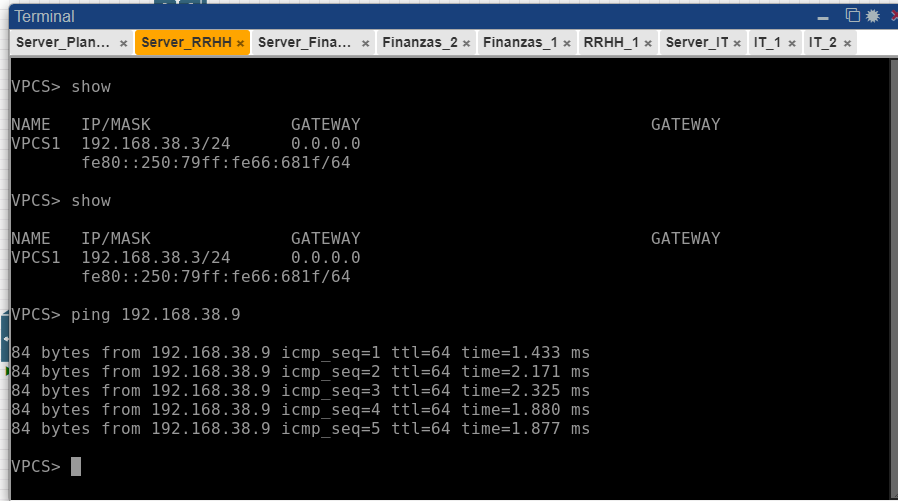
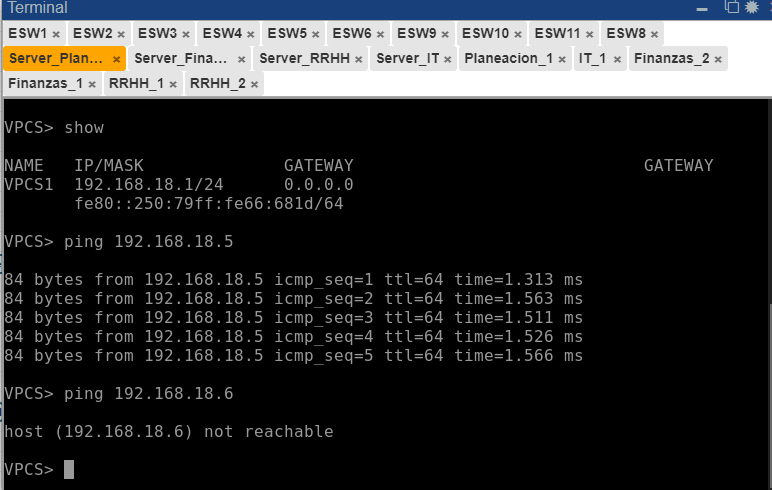

# Redes 1 - Proyecto 1 - Manual Técnico

| Nombre                           | Carné                                      |
|:--------------------------------:|:------------------------------------------:|
| Erick Ivan Mayorga Rodríguez     | 201901758                                 	|

## INTRODUCCIÓN

Se creo una red para la coexistencia de los departamentos de planeacion, Finanzas RRHH e IT

## Direcciones IP y VLAN 

### Ips
 
Planeacion

192.168.18.1

192.168.18.5
 
 

Finanzas

192.168.28.2

192.168.28.7

192.168.28.8
  

RRHH 

192.168.38.3

192.168.38.9

192.168.38.10
  

IT

192.168.48.4

192.168.48.6

192.168.48.11

  

## Vlans
Planeacion 18

Finanzas  28

RRHH 38

IT 48
   

## Implementacion de Topologias

## Detalle de Comandos

### Configuracion Modo Cliente

### Configuracion Modo Truncal

### Creacion de Vlans

### Propagacion de Vlans

## Ping entre los Host 

### Server_RRHH hacia RRHH_1

### Server_planeacion hacia Planeacion_1

